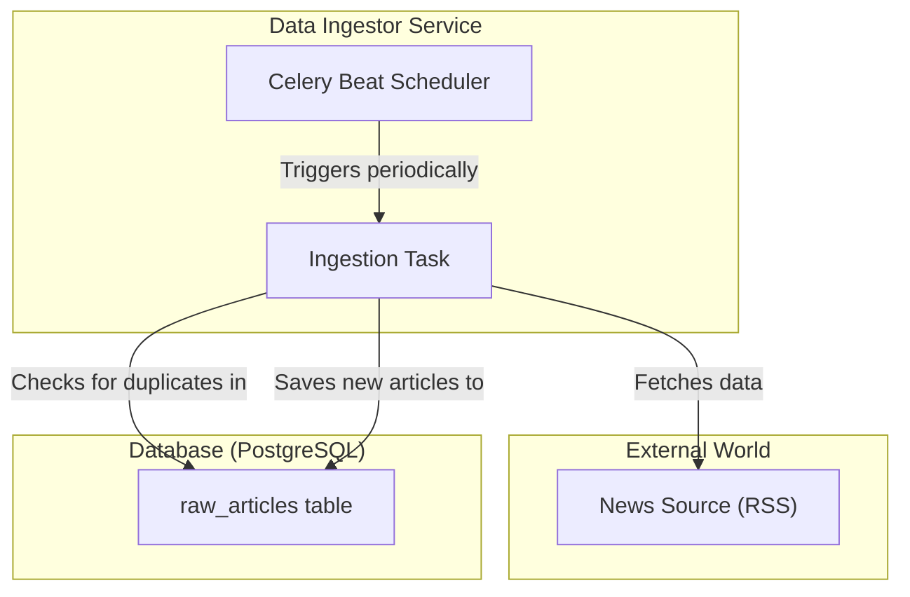

# Service Details: Data Ingestor

This service is the data gateway of the Sentilyzer platform to the external world. Its responsibility is to periodically collect data from various financial news sources and save this data in a raw, unprocessed form to the database.

> **Related Architecture Decisions:**
> - [ADR 003: Using Celery & Redis for Asynchronous Task Management](../../4_architecture_decisions/adr/003-asynchronous_processing_with_celery.md)

## Responsibilities

- **Scheduled Data Collection:** Uses `Celery Beat` to trigger data collection tasks at specified intervals (e.g., every hour).
- **Data Fetching:** Fetches new news articles from external sources like RSS feeds.
- **Duplication Control:** Prevents re-adding articles that already exist in the database (usually checked via `article_url`).
- **Raw Data Storage:** Saves new and unique articles to the `raw_articles` table without any modification.

## Technical Flow Diagram

The following diagram shows the data collection cycle of the `Data Ingestor` service.

## Code Structure and Important Components

- **`scheduler.py`**: This file defines scheduled tasks for `Celery Beat`. The frequency of each task is configured here.
- **`tasks.py`**: Contains the actual data collection logic.
    - **`fetch_rss_feeds` (Example Task Name)**: This Celery task reads configured RSS sources.
    - Checks if the `article_url` already exists in the database for each article.
    - If the article is new, creates a `RawArticle` object and saves it to the database. Sets the `is_processed` flag to `False` to allow the `Sentiment Processor` service to pick up this data.

> **Update Note:** When a new data source (different RSS, an API, etc.) is added, a new task should be added to `tasks.py` and its schedule should be configured in `scheduler.py`. These changes should also be reflected in this document.
