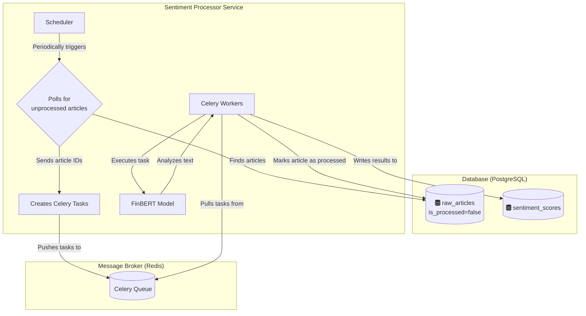

# Service Details: Sentiment Processor

This service can be considered the "brain" of the Sentilyzer platform. It takes raw text data and assigns sentiment values using artificial intelligence. The service is designed to be completely asynchronous for high efficiency and scalability.

> **Related Architecture Decisions:**
> - [ADR 002: Event-Driven Communication Through Database](../../4_architecture_decisions/adr/002-database_as_event_bus.md)
> - [ADR 003: Using Celery & Redis for Asynchronous Task Management](../../4_architecture_decisions/adr/003-asynchronous_processing_with_celery.md)

## Responsibilities

- **Data Discovery:** Periodically scans the database to find unprocessed articles (`is_processed = false`).
- **Task Distribution:** Divides articles to be processed into small groups (batches) and sends them to the **Celery** task queue.
- **Sentiment Analysis:** Uses the **FinBERT** model, specifically trained for financial texts, to calculate the sentiment score (positive, negative, neutral) and value of texts.
- **Result Storage:** Writes analysis results to the `sentiment_scores` table and marks the processed article as processed in the `raw_articles` table.

## Technical Flow Diagram

The following diagram shows step by step how an article is processed by the `Sentiment Processor`.

## Code Structure and Important Components

- **`worker.py`**: Contains the main logic of the service.
- **`FinBERTBatchAnalyzer` Class**:
    - Loads the model (`ProsusAI/finbert`) and tokenizer.
    - Automatically moves the model to GPU if available.
    - Provides high efficiency by processing texts in batches with the `predict_batch` method. This enables analyzing hundreds of texts at once instead of loading the model repeatedly for each text.
    - Has a `_fallback_sentiment` method that performs a simple keyword-based analysis in case the model fails to load. This increases system resilience.
- **`process_sentiment_batch` Celery Task**:
    - Gets a group of article IDs from the task queue in Redis.
    - Fetches the article texts corresponding to these IDs from the database.
    - Uses `FinBERTBatchAnalyzer` to analyze the texts.
    - Writes results to the database.
- **`poll_and_dispatch_tasks` Scheduled Task**:
    - Runs periodically (e.g., every 5 minutes).
    - Queries articles waiting to be processed in the database.
    - Divides these articles into `process_sentiment_batch` tasks and sends them to the Celery queue.

> **Update Note:** This document should be updated when the artificial intelligence model (`ProsusAI/finbert`) or analysis logic changes.
