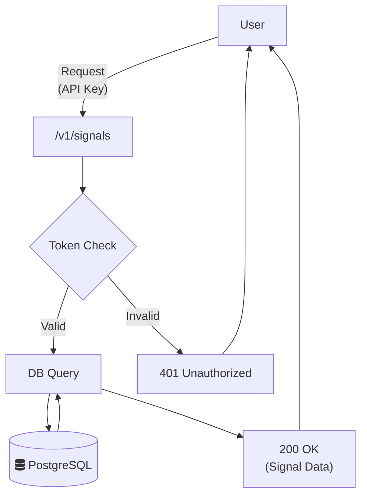

# Service Details: Signals API

This service is the main interface that presents processed sentiment analysis data to the external world. It is built on **FastAPI** and aims to provide a modern, secure, and scalable API.

> **Related Architecture Decisions:**
> - [ADR 001: Service-Oriented Architecture](../../4_architecture_decisions/adr/001-service_oriented_architecture.md)
>
> **User Guide:**
> - [API Usage Guide and Endpoints](../../2_user_guide/01_api_usage_and_endpoints.md)

## Responsibilities

- **Authentication:** Provides secure access by validating API keys.
- **Request Validation:** Validates incoming request formats using `Pydantic` models.
- **Data Presentation:** Queries relevant sentiment analysis data from the database and presents it as JSON in a standard format.
- **Rate Limiting:** Prevents API abuse.

## Technical Flow Diagram

The following diagram shows the lifecycle of a user's request to the `/v1/signals` endpoint.

## Code Structure and Important Components

- **`main.py`**: The main file where the FastAPI application is created and endpoints are defined.
- **Authentication (`get_current_user`)**: Takes the API key from the `Authorization: Bearer <token>` header, compares its hash with the `ApiKey` table in the database, and returns a valid user. This function is injected into endpoints using `Depends`.
- **Pydantic Models (`services/common/app/schemas/sentiment.py`)**: Defines the structure of API requests and responses. Ensures automatic validation of incoming data and conformity of outgoing data to a specific schema. This makes the code more reliable and less prone to errors.
- **Database Access (`get_db`)**: Manages SQLAlchemy sessions. Creates a new database session for each request and closes it when the request is completed. This is provided through the `Depends` mechanism.

> **Update Note:** When a new endpoint is added to the API or the request/response structure of an existing endpoint changes, both this document and the user guide under `2_user_guide` must be updated.
