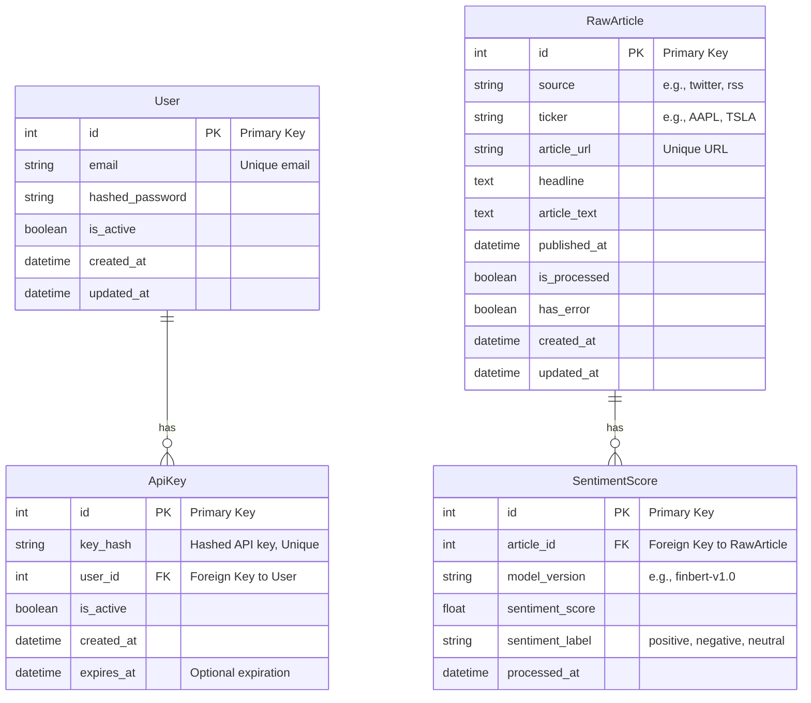

# Database Schema and Migrations

This document explains the data layer of the Sentilyzer platform, relationships between tables, and the process of making changes to the database schema.

> **Note:** This document reflects the database models which are the "single source of truth" for the project. Any changes made to `services/common/app/db/models.py` require updating the schema and explanations here.

## Entity-Relationship Diagram (ERD)

The following diagram shows the main tables in the database and their relationships.



## Database Models

Database tables are defined as SQLAlchemy models in the `services/common/app/db/models.py` file.

### `User`
Represents users who have access to the system. API keys are associated through this table.
- `id`: Primary Key
- `email`: User's unique email address.
- `hashed_password`: User's password hashed for security.
- `is_active`: Indicates whether the user account is active.

### `ApiKey`
Represents the keys users use for programmatic access to the API.
- `id`: Primary Key
- `key_hash`: Hashed version of the API key given to the user stored in the database. The key itself is never stored.
- `user_id`: Foreign Key indicating which user the key belongs to.
- `is_active`: Indicates whether the key is valid.
- `expires_at`: Optional date indicating when the key will become invalid.

### `RawArticle`
Stores raw text data collected from external sources (Twitter, RSS feeds, etc.). This table is the entry point of the data processing pipeline.
- `id`: Primary Key
- `source`: Where the data came from (e.g., "twitter").
- `ticker`: The stock symbol the article is related to (e.g., "TSLA").
- `article_url`: Unique URL of the article.
- `headline`: Article headline.
- `article_text`: Full text of the article.
- `is_processed`: Flag indicating whether sentiment analysis has been performed for this article. The `Sentiment Processor` service uses this flag.
- `has_error`: Indicates whether an error occurred during processing.

### `SentimentScore`
Stores sentiment analysis results for each text in the `RawArticle` table.
- `id`: Primary Key
- `article_id`: ID of the analyzed article (Foreign Key to `RawArticle` table).
- `model_version`: Version of the model that performed the analysis (e.g., "finbert-v1.0").
- `sentiment_score`: Numerical sentiment score produced by the model.
- `sentiment_label`: Label corresponding to the score (e.g., "positive", "negative", "neutral").
- `processed_at`: Timestamp when the analysis was performed.

## Database Migrations (Alembic)

Changes to the database schema are managed with **Alembic**. This ensures schema changes are versioned like code and remain consistent across all environments (development, test, production).

For steps on creating and applying new migrations, see the [Getting Started: Development Environment Setup](./01_getting_started.md) document.

For more information: [Alembic Official Documentation](https://alembic.sqlalchemy.org/en/latest/)

**Example: Creating a New Migration**
```bash
docker-compose exec signals_api alembic revision --autogenerate -m "A descriptive migration message"
```

**Example: Applying Migrations**
```bash
docker-compose exec signals_api alembic upgrade head
```
